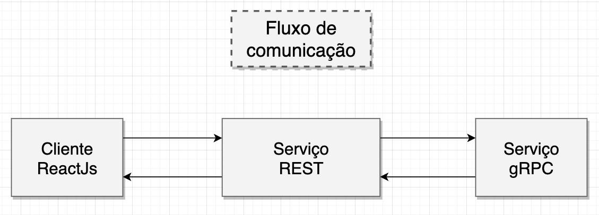

# Microsserviço com gRPC

Este repositório armazena a estrutura inicial de um exemplo de projeto utilizando comunicação entre serviços com [gRPC](https://grpc.io/) e  [Node.js](https://nodejs.org/).

## Bibliotecas
- [@grpc/grpc-js](https://www.npmjs.com/package/@grpc/grpc-js) - Biblioteca gRPC para Node.js
- [@grpc/proto-loader](https://www.npmjs.com/package/@grpc/proto-loader) - Utilitário para carregamento de arquivos .proto para gRPC

## Instalando dependências e iniciando o projeto
O projeto foi configurado utilizando [yarn workspaces](https://yarnpkg.com/features/workspaces), então todos os comandos devem ser feitos a partir da raiz do projeto.

Instalando dependências:
```shell
yarn install
```
Iniciando o projeto:
```shell
yarn start
```

Após iniciar o projeto, basta acessar o link http://localhost:3000 para ter acesso a aplicação ReactJs que consome um serviço REST que consome um serviço gRPC.



## Sobre o projeto
Temos 3 serviços criados no projeto, ambos iniciam em paralelo quando o comando `yarn start` é executado.
- [@foxkey/micro-grpc](localhost:50051) - Serviço gRPC que roda na porta localhost:50051
- [@foxkey/micro-rest](http://localhost:9000) - Serviço REST que retorna dados para a aplicação web
- [@foxkey/client](http://localhost:3000) - Cliente ReactJs para listagem e cadastro de produtos, resultado da comunicação entre os serviços
